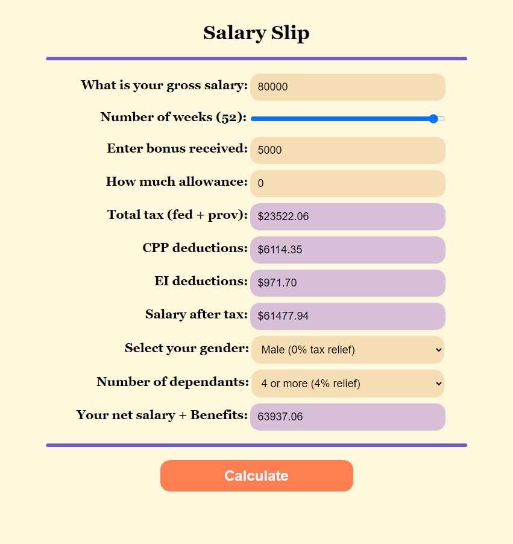

# Salary Slip

1. Take __gross salary__ from user.
2. Apply deductions as __EI__, __CPP__ and __IncomeTex__ as percentages.
3. Add __Bonus__ and __Allowance__ in dollars from users.
4. Apply deduction of __1% IncomeTex__ for __female__ only.
5. Apply conditions on dependants as:
    - __2__ dependants no deductions in __IncomeTex__.
    - __3__ dependants deduction of __2%__.
    - __4__ dependants deduction of __4%__.

# Screenshot

# References:

- [wealthsimple.com](https://www.wealthsimple.com/en-ca/tool/tax-calculator/ontario)
- [filingtaxes.ca](https://filingtaxes.ca/why-are-bonuses-taxed-so-high-in-ontario)
- [employment-insurance-ei - CRA](https://www.canada.ca/en/revenue-agency/services/tax/businesses/topics/payroll/payroll-deductions-contributions/employment-insurance-ei/ei-premium-rates-maximums.html)
- [canada-pension-plan-cpp - CRA](https://www.canada.ca/en/revenue-agency/services/tax/businesses/topics/payroll/payroll-deductions-contributions/canada-pension-plan-cpp/checking-amount-cpp-you-deducted.html)
