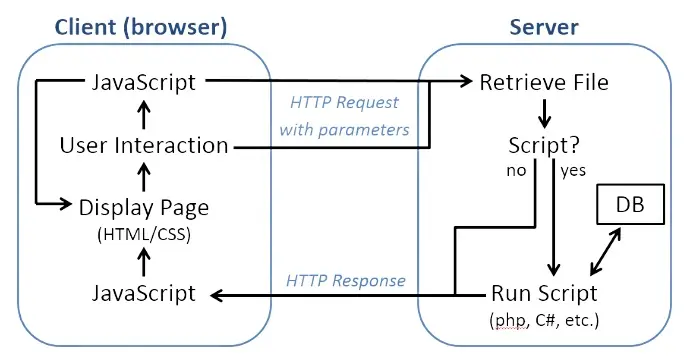
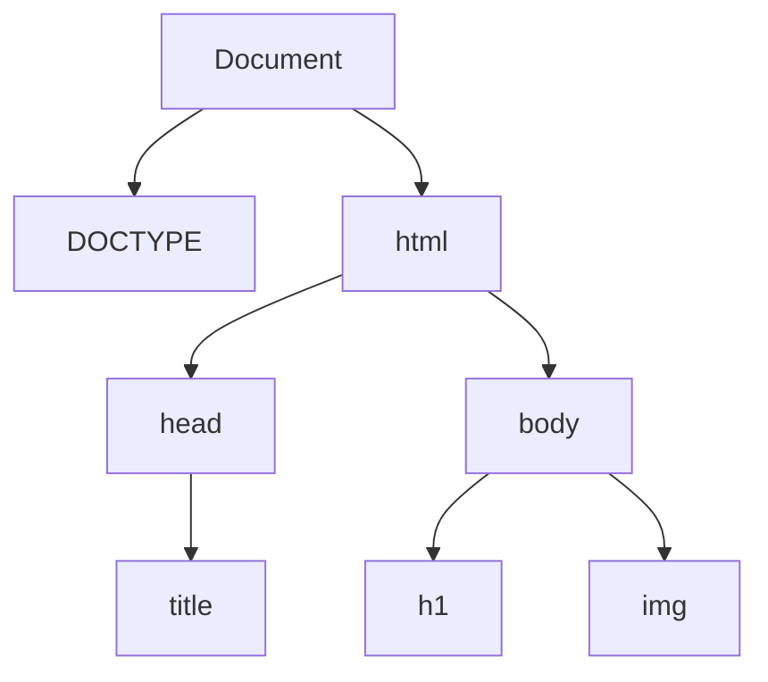

# JavaScript

## The JavaScript Language

- JavaScript is a client-side programming language
- JavaScript code is retrieved from the server along with HTML and CSS code, and
  executed by an interpreter built into the browser
- JavaScript helps make a web page dynamic by responding to user events (mouse
  movements, button clicks, etc.) and making real-time changes to the content
  and style of the page
- Unlike programming on the server-side, where you can use any language,
  JavaScript is the only language for front-end web development



## Hello, World!

- In Chrome, if you press Ctrl-Shift-i, or F12, you can enter the Developer
  Tools and go to the Console tab
- The Console is a JavaScript shell, just like the Python shell
- Type the following in the Console and hit enter:

```js
console.log("Hello, World!");
```

- To turn this into a _real_ program, you can include an HTML script element
  like the one below on a web page and then load the page in Chrome
- Note that because JavaScript executes in the browser, you will not need XAMPP
  for this – just open the file directly

```html
<script>
    console.log("Hello, World!");
</script>
```

- After loading the page in Chrome, open the Console
- You should see the output along with the name of the file and the line number
  to show you where it came from
- You can have multiple script elements on a single page
- You can also load your script from a file of JavaScript code, like this:

```html
<script src="js/hello_world.js"></script>
```

- `console.log` is meant for debugging output, not for talking to the user
- But we will use it to explore the JavaScript language.

## JavaScript Basics

- Here are some basic features of the JavaScript language, leveraging what you
  already know from Python, Java, and/or PHP:
- JavaScript is **imperative** and **object-oriented**
- C-like syntax (for, while, do, switch, if, operators, etc.)
  - variable names do not need `$`
  - `+` is for concatenation and `.` (dot) is for accessing instance variables
    and methods
  - Strings can use double- or single-quotes
  - semi-colons are optional in most cases, but it’s good practice to use them
- Dynamically-Typed
  - declare variables with the let keyword1
  - undeclared variables are global by default
  - supported types include Boolean, Number, String, Object, Null, and Undefined
- Weakly-Typed
  - supports `===` and `!==` for matching type and value
  - It has flexible arrays and supports array literals with [ ... ]
  - Arrays and strings are objects with methods and a `.length` property
- It has a `Math` object with methods like `Math.random()` and `Math.round()`

## Functions in JavaScript

- You can declare a function in JavaScript using a very basic syntax
- You don’t need to specify types for parameters or return values
- If you do not use a return statement, the function will return the value
  undefined
- You can also specify default values for parameters

```js
function sayHi(name) {
  return "Hello, " + name + "!";
}
```

- JavaScript functions are very flexible
- As long as you get the function name right, you can call it with any
  combination of arguments
- All the function calls below are legal:

```js
// parameter gets value undefined sayHi("John", "Doe");
// second argument is discarded
sayHi("John");
sayHi();
```

- There is no function overloading in JavaScript, but you can achieve something
  similar by using default argument values

```js
function spam(a, b = 2, c = 3) { // b and c have default values
  return a + b + c;
}
spam(1); // Uses both default values
spam(1, 1); // Uses default value for c
spam(1, 2, 3);
```

- If you give a parameter a default argument value, all the parameters that
  follow must also have default values

```js
function spam(a, b = 0, c) { //  Not allowed c must have a default as well
  return a + b + c;
}
```

## Functions as Values

- There is something very different about JavaScript functions that separates
  them from functions and methods in Java, C#, and PHP
- JavaScript functions are values, just like Strings, Numbers, Booleans, and
  Objects
- Like any other value, a function can be stored in a global or local variable
  and can passed as a parameter to another function
- The declaration of `sayHi` shown above actually declares a variable named
  `sayHi` and assigns a function to it We could have accomplished the same thing
  like this:

```js
// No function name here, this function is anonymous
function(name) {
    return "Hello, " + name + "!";
};

// Store reference into variable
const sayHi = function(name) {
    return "Hello, " + name + "!";
};
```

- The above statement declares a variable named sayHi and assigns an anonymous
  function to it
- The word _anonymous_ means _nameless_
- The function is anonymous because it is created without a name being specified
  between the function keyword and the parameter list
- The _name_ used to call the function comes from the assignment of the function
  to a variable
- Anonymous functions are sometimes also referred to as function literals

## Functions Within Functions (Nested Functions)

- A function is declared inside another function
- The name `innerFunction` becomes a local variable of `outerFunction`

```js
function outerFunction(a, b, c = 0) { // c has a default value
  function innerFunction(a, b) {
    console.log("inner function called!");
    return a * b; // local variable
  }
  console.log("outer function called!");
  return innerFunction(b, c) + innerFunction(a, c);
}
```

## Passing a Function as an Argument

- Here, the `doSomething` is expecting another function to be passed to it as an
  argument
- Then it calls that function
- Parameter `f` is expected to be a function

```js
function doSomething(f, a) {
  return f(a);
}
```

- You could call `doSomething` and pass it the `sayHi` function from above as
  its first parameter
- Passing sayHi as an argument
- Why isn’t it `sayHi()`?

```js
doSomething(sayHi, "Serena");
```

- You could also pass it an anonymous function for its first argument
- This looks a little strange if you’ve never seen anything like it before.
- Passing an anonymous function as an argument

```js
doSomething(function (x) {
  return Math.floor(Math.random() * x);
}, 34);
```

- The second argument to `doSomething` is here
- Two built-in functions that make use of this are `setInterval` and
  `setTimeout`
- Both these functions take two parameters: a function `f` and an integer `d`
- Then they call `f` after `d` milliseconds (a millisecond is one thousandth of
  a second)
- The setInterval function will continue to call `f` every `d` milliseconds
  after the first call
- Calls `myFunction` after 1 second
- Calls an _anonymous_ function every ½ second
- https://www.w3schools.com/js/js_timing.asp

```js
setTimout(myFunction, 1000);

setInterval(function () {
  console.log("hi");
}, 500);
```

## The Document Object Model (DOM)

- Every JavaScript program running in a web browser has access to a document
  object
- This object holds the browser’s internal representation of the page, known as
  the Document Object Model (DOM)
- The DOM contains all the information the browser constructs from the HTML
  tags, CSS style rules, and other components that make up the source code of
  the page
- Understanding the DOM is key to becoming an effective JavaScript programmer
- A web app doesn’t talk to the user with `console.log`
- The _output_ of a JavaScript app consists of DOM Manipulation: dynamic,
  real-time changes to the content and style of the DOM

## The DOM Tree and the document Object

- An HTML page can be viewed as a hierarchical tree of elements (nodes)
- When the browser loads an HTML page it constructs an object for each element,
  links it to the elements it contains (its children) and to the element that
  contains it (its parent)
- Beside it is a picture of the DOM that the browser would construct after
  reading the HTML code
- Note the use of the terms parent, child, and sibling to describe the
  relationships in this tree structure

```html
<!DOCTYPE html>
<html>

<head>
    <title>Hello World</title>
</head>
<body>
    <h1 id='message'> Hello, World!</h1>
    
</body>

</html>
```



- The document node in the picture above is referred to as the root node, and
  the nodes at the bottom (title, h1, img) are referred to as leaf nodes
- Because of its tree-like structure, the DOM is sometimes referred to as the
  DOM Tree
- You can access the DOM in the JavaScript Console by typing document
- You can also view it by clicking on the Elements tab in the Chrome Developer
  Tools
- In the Elements tab, you can double-click and make changes to the DOM
- Any change you make will immediately be reflected on the page
- When you reload, the browser will reload the original HTML code and your
  changes will disappear
- Any JavaScript program you write has access to the DOM via the document object

## DOM Manipulation

- Making changes to the DOM requires two basic steps:
- Retrieve the element or elements you want to change
- Change the content, style, or attributes of the elements you retrieved

### Retrieving a Single Element

- There are lots of methods built into the document object for retrieving
  elements, but the easiest way to retrieve an element is to give it an id
  attribute, like this:

```html
<h1 id='message'>Hello, World!</h1>
```

- Then in JavaScript, you can call the `getElementById` method of the document
  object, like this:

```js
let node = document.getElementById("message");
```

- The code above retrieves the single DOM element with its id attribute set to
  **message** and stores it in a variable called node
- If there is no such element, `getElementById` returns null

### Changing Content

- To change the content of an element, you can access its innerHTML field

```js
let node = document.getElementById("message");
node.innerHTML = "I changed!";
```

- You can also embed HTML tags into the innerHTML field to create new DOM
  elements
- Try the following in the same Console:

```js
let node = document.getElementById("firstdiv");
node.innerHTML = "<p>I'm a paragraph!</p>";
```

- This will create a new paragraph element within the element that was retrieved
- Warning: Be careful with syntax
- If you type `innerHtml` or `inerHTML` instead of `innerHTML`, your code will
  fail silently
- We’ll explain why in the section on JavaScript objects

### Changing Style

- To change the CSS properties of an element, you can access its style attribute

```js
let node = document.getElementById("message");
node.style.color = "darkred";
```

- The `.style` instance variable holds an object with an instance variable for
  every possible CSS property
- You can assign any legal CSS property to any of these instance variables, but
  hyphenated properties like `background-color` and `border-top-left-radius`
  must be changed to camel case (`backgroundColor` and `borderTopLeftRadius`
  respectively)

```js
let node = document.getElementById("message");
node.style.backgroundColor = "lightblue";
node.style.position = "relative";
node.style.left = "-100px";
node.style.top = "200px";
```

- Make sure you know what you’re doing when changing style properties
- If you accidentally type an invalid property or an invalid value, the code
  will probably fail silently
- If you want to change lots of properties at once, the best way to do it is to
  define a new class in your CSS file, and then change the class attribute of
  the element
- You can access the class attribute using the className instance variable, like
  this:

```js
let node = document.getElementById("container");
node.className = "redcontainer";
```

### Changing Other Attributes

- Any other attribute of a node can also be changed by accessing an instance
  variable of the node with the same name as the attribute you are changing

```js
let node = document.getElementById("pic");
node.src = "images/bird.webp";
```

### Manipulating Many Elements at Once

- Sometimes you need to change the content, style, or attributes of multiple
  elements
- For this, you can use the `querySelectorAll` method of the document object
- This method allows you to specify a CSS Selector, and retrieve an array-like
  list of all DOM elements that match the selector
- Go to a random Wikipedia page, and try the following commands to see what
  nodes get retrieved:

```js
let nodes = document.querySelectorAll("p");
let nodes = document.querySelectorAll(".mw-body-content");
```

- Once you have retrieved the list of elements, you can use a for loop to change
  them, like this:

```js
for (let i = 0; i < nodes.length; i++) {
  nodes[i].innerHTML = "Wiki Hacked!";
}
```

- Or you can use the handy `forEach` method that is built into all JavaScript
  arrays
- This method takes a function as a parameter and calls then calls that function
  repeatedly
- Each time it calls the function, it passes it a new item from the array as a
  parameter

```js
nodes.forEach(function (node) {
  node.style.color = "red";
});
```

## Events

- A dynamic web app responds to user events, like mouse movements, button
  clicks, etc
- To respond to events, you create event listener functions and specify which of
  these functions should be executed for which event
- There are lots of ways to add event listeners in JavaScript, but we are only
  going to use the `addEventListener` method

### The Click Event

- The following code will add the `dropHeading` function as the click event
  listener for the `<h1>` element

```js
let node = document.getElementById("message");
node.addEventListener("click", dropHeading);
```

- If you execute the above code in the console, the dropHeading function will be
  called every time you click the `<h1>` element

### The MouseOver Event

- This one adds the `changePicture` function as the mouseover event listener for
  the picture
- Try this in the Console, then move the mouse over the picture

```js
let node = document.getElementById("pic");
node.addEventListener("mouseover", changePicture);
```

### MouseOut with an Anonymous Function

- You can also add anonymous functions as event listeners
- The listener is an anonymous function

```js
let node = document.getElementById("pic");
node.addEventListener("mouseout", function () {
  this.src = "images/smiley.jpg";
});
```

- The `this` keyword is a shortcut to the _element_ that you added the listener
  to
- Now when you move the mouse away from the picture, it will change back to
  `smiley.jpg`

### Mouse Event Types

- Mouse event types:
  - click
  - dblclick (double click)
  - mouseover
  - mouseout
  - mousemove
  - mousedown (mouse button pressed down)
  - mouseup (finger lifted off mouse button)

### The Event Object

- Event listener functions are always passed an event object as an argument
- For mouse events, this object contains information such as which mouse button
  was clicked, the location of the mouse, etc
- To receive it, an event listener function needs a parameter
- Here, a listener function that receives an event object for a mouse event and
  displays some of the information contained within it:

```js
function listener(event) {
  console.log(event.target); // element that triggered event
  console.log(event.which); // mouse button number (if any)
  console.log(event.clientX + "," + event.clientY); // location
}
```

- MouseEvent objects https://www.w3schools.com/jsref/obj_mouseevent.asp

### The Load Event

- In order to add event handlers to DOM elements using `addEventListener`, we
  have to be sure that the DOM has been fully created first
- So when you use `addEventListener` in a script on a web page, it is a good
  idea to put your code inside an event listener for the page’s `load` event

```js
window.addEventListener("load", function () {
  // code goes here
});
```

- You can think of this as being a bit like a **main method** for your
  JavaScript app
- The browser will wait until the page is completely loaded and the DOM is fully
  created, then it will run the anonymous function with your code in it
- Inside that function, you can create variables, functions, and add event
  listeners safely
- Putting all your code in the listener function also makes all your function
  and variable names local to that function
- This helps avoid conflicts between your names and names used in other
  JavaScript libraries that you might be using

### Debugging Tip

- The one drawback to putting all your code inside a load event listener is that
  all your variables and functions become local to that listener function
- This means you can’t examine your variables or run your functions from the
  JavaScript Console
- As a temporary debugging step, you can expose your functions and variables by
  removing the let keyword
- This makes them global and now you can examine and run them in the console

```js
let success = function (text) {
  let span = document.getElementById("target");
  span.innerHTML = span.innerHTML + text + " ";
  console.log(text); //debug
};

let button = document.getElementById("clickme");
```

### Making Things Look Clickable

- When you want the user to click on an element, it is a good idea to make it
  look _clickable_
- Otherwise, users might not notice that they’re expected to click it
- Use an `<input>` element with `type="button"`
- Change the CSS cursor property to pointer
- This will make the cursor change when the element is moused-over to indicate
  that it can be clicked
- Use `:hover` in a CSS rule to change colors or other properties as the user
  mouses over the element
- Use CSS to style your click target to look like a button, or so that it stands
  out in some way
- It’s also always a good idea to use padding to make the click target larger
  for mobile users

## Forms in JavaScript

- JavaScript programs often need to interact with forms and input elements
- In some Web Apps, JavaScript code helps to validate a form interactively
  before its contents are sent to a PHP program
- In standalone JavaScript Apps, forms can be used as a way to get more detailed
  forms of input from the user

### Retrieving Form Elements

- You can retrieve `<form>` and `<input>` elements using `getElementById` and
  `querySelectorAll` if you want to
- The CSS attribute selector can come in handy for separating different input
  elements

```js
// Get all the numeric input elements in the document
document.querySelectorAll("input[type=number]");
```

- But there is also a special `document.forms` object that can make things a bit
  easier
- If you give your `<form>` and `<input>` elements `name` or `id` attributes,
  like this:

```html
<form id="regForm">
    <input type="text" name="userid">
    <input type="submit">
</form>
```

- You can retrieve them from `document.forms` using the form `name/id` followed
  by the input element `name/id`, like this:

```js
let node = document.forms.regForm.userid;
```

- Whether you choose to use `id` or `name` for your `<input>` elements is up to
  you, however if you are planning to use the form to send parameters to a PHP
  program, you will always need the name attribute
- The document.forms object can also be treated like a multi-dimensional array
  of forms and input elements
- If the form shown above was the second one in the document, you could retrieve
  the userid field like this:

```js
let node = document.forms[1][0];
```

### Reading Form Input

- From the point of view of JavaScript, `<form>` and `<input>` elements are just
  like any other element
- You can modify their style, attributes, and contents through JavaScript
- But `<input>` elements are empty elements with no innerHTML contents
- For most `<input>` element types, the content typed by the user can be found
  in the value field
- You can read from this field to get input

```js
let userid = node.value;
```

- The code above retrieves whatever the user typed into the input field
- You can change an `<input>` element’s contents by assigning to its value
  field, like this:

```js
node.value = "xxxxxxxx";
```

- Radio buttons and checkboxes can have value attributes, but in a JavaScript
  program, we’re usually more interested in whether they are checked or
  unchecked
- When the user checks and unchecks a radio button or checkbox, they are setting
  the checked field to true or false

### Converting Form Input

- No matter what the type of an `<input>` element is, its value field will
  always hold a string
- If you are expecting a numeric value, you will have to convert it explicitly
- You can use the built in functions `parseInt` and `parseFloat` to convert
  strings to numeric values
- If the strings cannot be converted, these functions return the special value
  `NaN` (Not a Number)
- There is a third function, `isNaN`, to check for this possibility

### Mouse Events

- All the mouse events you learned about earlier (most notably the click event)
  can be applied to `<input>` elements as well

### The Submit Event

- The most important `<form>` event is the submit event
- This event happens whenever a form element is submitted (by pressing a submit
  button, by pressing enter in a text box, etc)
- If you want to process the form elements after the user is finished filling
  them in, you should attach a listener for the submit event of the form
- The default action when the user submits the form is to trigger a new HTTP
  Request and load a page in response
- But you might not want that to happen, especially if this is a standalone
  JavaScript app
- You can prevent the form from submitting by calling the preventDefault method
  of the event object

```js
myForm.addEventListener("submit", function (event) {
  event.preventDefault(); // process the form input here
});
```

### Other Form Events

- Sometimes you want to respond to every single keystroke in a text box
- The input or keyup events can be used for that
- To respond to a change in value of other `<input>` element types, try the
  change event
- To do something when an `<input>` element gains focus, use the focus event
- And to do something when it loses focus, use the blur event

## Creating Your Own Objects

- Unlike PHP, which started as an imperative language and had object-oriented
  capabilities added later, JavaScript was built using object-oriented
  principles
- However, its approach to objects is quite different from most other languages

### Object Literals

- The quickest way to create an object in JavaScript is to use an object literal
- An object literal is an expression in braces `{ ... }` that specifies a
  mapping from instance variables to values
- In the examples below, empty is an empty object, and person is an object with
  3 instance variables

```js
// Empty object
let empty = {};

// Object with 3 instance variables (fields)
let person = {
  id: 1021,
  name: "John Doe",
  balance: 123.99,
};
```

- The instance variables of person are all public
- You can access them with the dot operator

```js
console.log(person.name);
person.balance += 9.99;
```

- If you want to add methods to your objects, you can take advantage of the fact
  that function names are variable names
- A method is just an instance variable that has a function as its value

```js
// A method
let person = {
  id: 1021,
  name: "John Doe",
  balance: 123.99,
  addItem: function (price) {
    this.balance = this.balance + price;
  },
};
```

- The `this` keyword is not optional
- If you leave it out, you are creating a new global variable called balance

### Objects are Flexible

- You can add instance variables or methods to any object any time

```js
// Empty object
let circle = {};

// Adds an instance variable
circle.radius = 5.3;

// Adds a method
circle.getArea = function () {
  return this.radius * this.radius * Math.PI;
};
```

- This flexibility can be very handy, but it’s also the source of a lot of
  tricky logic errors in JavaScript

```js
let e = document.getElementById("message");
e.innerHtml = "New Message";
```

- The above code fails silently because the programmer made a typo (it’s
  `innerHTML`, not `innerHtml`)
- So instead of changing the `innerHTML` instance variable, this code adds a new
  instance variable named `innerHtml` to the object `e`
- Since this field is not recognized by the browser, it has no visible effect

### Constructor Functions

- Every function is also a constructor, though it doesn’t make much sense to use
  most functions in this way
- If you want to use a function to create an object, use the this keyword to
  create instance variables and methods inside body of the the function, and
  then use the new keyword when you call the function
- It might also be a good idea to name the function with a capital letter to
  indicate that it’s intended to be used as a constructor

```js
function Person(name, id, balance = 0) {
  // Instance variables
  this.id = id;
  this.name = name;
  this.balance = balance;
  // Method
  this.addItem = function (price) {
    this.balance += price;
  };
}

let john = new Person(1011, "John", 123.99);
```

### Create new object

- All the instance variables and methods you define with the this keyword will
  be public
- If you want private members, just declare them as regular variables

```js
function Person(name, id, balance = 0) {
  this.id = id;
  this.name = name;
  this.balance = balance;
  this.addItem = function (price) {
    this.balance += price + computeTax(price);
  };

  let HST = 0.13;

  let computeTax = function (amount) {
    return amount * HST;
  };
}
```

### Classes

- Under the hood, JavaScript does not contain classes
- Objects are created using constructor functions, and inheritance is achieved
  using special prototype objects
- Class declaration syntax is a recent addition to the language
- It is syntactic sugar that has been added to make object creation and
  inheritance easier for programmers who are used to other object-oriented
  languages
- Under the hood, a class declaration is converted into constructor functions
  and prototype objects

```js
class Person {
  constructor(name, id, balance = 0) {
    this.id = id;
    this.name = name;
    this.balance = balance;
  }

  addItem(price) {
    this.balance += price;
  }
}
```

- The class syntax supports the extends and static keywords, but it does not
  currently support private members, though this may be coming in a future
  version of the language

# ECMA Script (ES6)

- ES6 introduced new features and syntactic sugars to JavaScript, browsers now
  largely support ES6
  - ES stands for ECMAScript, standardization of JavaScript
- We'll see new concepts when using React and reading React examples online
  - Objects, Promises, Arrow functions, etc.
  - We'll cover concepts we know you'll see in examples for sure
  - We can't cover every possible language feature however!
- ES6 changes are _extensive_ and include some rarely used concepts/syntax, as
  you get closer to bleeding edge tech, it's just something you have to expect

## JavaScript objects

- We've been using below syntax for JS objects already
- Key/value pairs to define properties and values
- Methods as properties with functions as values
- `this` keyword to access properties of this object

```js
var person = {
  firstName: "John",
  lastName: "Doe",
  id: 5566,
  fullName: function () {
    return this.firstName + " " + this.lastName;
  },
};
```

- We can create constructors for objects...

```js
function Person(first, last, age, eye) {
  this.firstName = first;
  this.lastName = last;
  this.age = age;
  this.eyeColor = eye;
}

var myFather = new Person("John", "Doe", 50, "blue");
```

## Classes

- We can use class and constructor as we may be familiar with from Java and
  other languages
- These don't really introduce anything fundamentally new however
- It's called a syntactic sugar because it's just another way of doing what we
  can already do

## JavaScript object with class

```js
class Rectangle {
  constructor(height, width) {
    this.height = height;
    this.width = width;
  }

  calcArea() {
    return this.height * this.width;
  }
}
```

## Child classes

```js
class Animal {
  constructor(name) {
    this.name = name;
  }

  speak() {
    console.log(this.name + " makes a noise.");
  }
}

class Dog extends Animal {
  constructor(name) {
    // call the super class constructor and pass in the name parameter
    super(name);
  }

  speak() {
    console.log(this.name + " barks.");
  }
}
```

## Arrow functions

- Arrow functions, like anonymous functions except...
  - Shorter syntax than regular functions
  - Does not have its own this
  - Generally not named when used, and generally used exactly where they are
    defined, often as part of a map
- Syntax:

```js
(param1, param2, ..., paramN) => { statements }
// below line is equivalent to: => { return expression; }
(param1, param2, ..., paramN) => expression
```

- Example:

```js
// 1
var materials = [
  "Hydrogen",
  "Helium",
  "Lithium",
  "Beryllium",
];

console.log(materials.map((material) => material.length));

// expected output: Array [8, 6, 7, 9]

// 2
[1, 2, 3].map((x) => 2 * x); // returns [ 2, 4, 6 ]
var funcName = (x, y) => x + y + 2;
funcName(2, 4); // returns 8
```

## let keyword

- `let` allows us to make declarations with block-level scope, previously JS
  only allowed for function and global level scope

```js
var x = 10; // Here x is 10
{
  let x = 2; // Here x is 2
}
// Here x is 10
```

- If we didn't use `let`, `x` would be re-declared and set to 2 outside the
  block scope as well!

## const keyword

- `const` allows us to create variables that cannot be re-assigned
  - Other than this, they behave like variables declared with the let keyword
- `const` strictly speaking does not define constant values as may be expected
  - Technically `const` defines a constant reference to a value
  - So for primitive values, it behaves like a constant value
  - But for `const` objects, because it's just the reference that is constant,
    we can still change the object's properties

```js
const PI = 3.14159265359;

// You can create a const object:
const car = { type: "Fiat", model: "500", color: "white" };

// You can change a property:
car.color = "red";

// ERROR THIS WON'T WORK!
car = { type: "Volvo", model: "EX60", color: "red" };
```

## bind

- The `bind()` method creates a new function from an existing function that has
  its this keyword set to the value provided
- Syntax:

```js
functionName.bind(this);
```

- Example:

```js
var module = {
  x: 42,
  getX: function () {
    return this.x;
  },
};

var unboundGetX = module.getX;

// outputs undefined
console.log(unboundGetX());

// The function gets invoked at the global scope
var boundGetX = unboundGetX.bind(module);

// outputs 42
console.log(boundGetX());

// outputs 42
console.log(module.getX());
```

## Promises

- Event handlers are great for situations where we want something to occur every
  time in response to an event
- What about something that only occurs once?

```js
var img1 = document.querySelector(".img-1");
img1.addEventListener("load", function () {
  // woo yey image loaded
});
```

- What if the image has already loaded before we setup the event handler?
- Promises behave like event listeners, except a promise can succeed or fail
  only once (and it cannot switch from success to failure)

```js
var promise = new Promise(function(resolve, reject) {
    // do a thing, possibly async, then...
    if (/* everything turned out fine */) {
        resolve("Stuff worked!");
    } else {
        reject(Error("It broke"));
    }
});

promise.then(function(result) {
    console.log(result); // "Stuff worked!"
}, function(err) {
    console.log(err); // Error: "It broke"
});
```

## Promises with jQuery AJAX

```js
// returns a promise!
var req = $.ajax({ url: "/data/people.json", dataType: "json" });
var success = function (resp) {
  $("#target").append("<p>people: " + resp.people.length + "</p>");
  console.log(resp.people);
};
var err = function (req, status, err) {
  $("#target").append("<p>something went wrong</p>");
};
req.then(success, err);
```

## Resources and Examples

- [Classes - Mozilla.org](https://developer.mozilla.org/en-US/docs/Web/JavaScript/Reference/Classes)
- [Arrow functions - Mozilla.org](https://developer.mozilla.org/en-US/docs/Web/JavaScript/Reference/Functions/Arrow_functions)
- [Let - w3school.com](https://www.w3schools.com/js/js_let.asp)
- [Const - w3school.com](https://www.w3schools.com/js/js_const.asp)
- [.bind() - Mozilla.org](https://developer.mozilla.org/en-US/docs/Web/JavaScript/Reference/Global_objects/Function/bind)
- [Promises - jqfundamentals.com](http://jqfundamentals.com/chapter/ajax-deferreds)
- [Promises - developers.google.com](https://developers.google.com/web/fundamentals/primers/promises)
