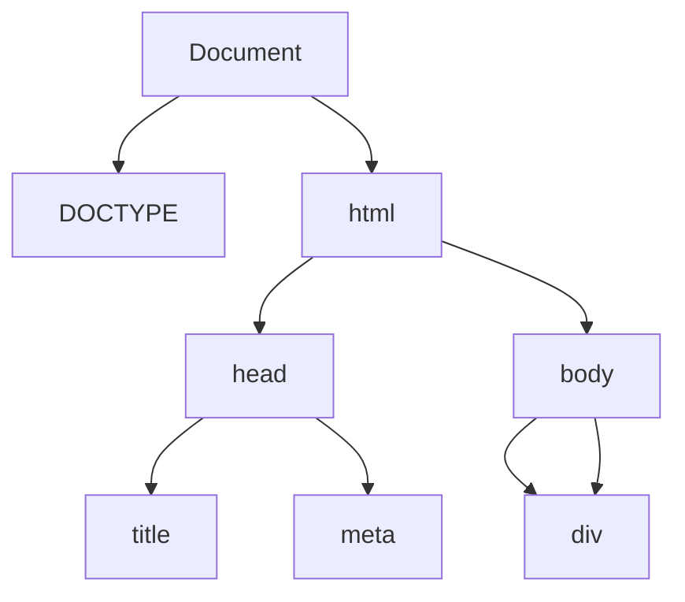

# jQuery

- JQuery is by far the most popular JavaScript library
- It is written in JavaScript and provides a more convenient syntax, a host of
  pre-built effects and animations, and automatic cross-browser compatibility
  for many JavaScript operations
- Using jQuery makes your code less efficient (every operation using jQuery
  requires a bit more processing time) but produces a massive increase in code
  economy (i.e. shorter code) and allows for much shorter development times
- Suppose you wanted to immediately hide all `<div>` elements with their class
  attribute set to aside
- Raw JavaScript:

```js
let ds = document.querySelectorAll("div.aside");
for (let i = 0; i < ds.length; i++) {
  ds[i].style.display = "none";
}
```

- Same thing using jQuery:

```js
$("div.aside").hide();
```

- The jQuery version will execute more slowly because you are calling two extra
  functions (the $ function and the hide method)
- Between them, this function and method will do the work of calling
  `querySelectorAll` and looping through the results
- But it is faster to write, easier to look at, and the user will almost never
  notice the difference in speed

## Installing jQuery

- To use jQuery in your code, you must load it using a `<script>` element
- Make sure you load jQuery before you load any code that relies on it
- You can load jQuery in one of two ways:
- Download the latest compressed version from jQuery.com, include it in your js
  folder, and then load it in a `<script>` element, like this:

```html
<script src="js/jquery-3.4.1.min.js"></script>
```

- Or you can download the latest version from the Google repository, like this:

```html
<script src="https://ajax.googleapis.com/ajax/libs/jquery/3.4.1/jquery.min.js"></script>
```

- Version can be different as of latest release

## Hello, World!

- A `<script>` element that loads jQuery from the Google repository
- You can load html file into Chrome, open the JavaScript Console, and type the
  following to set the `innerHTML` of the `<div>` element to “Hello, World!”:

```js
$("div").html("Hello, World!");
```

## The $ Function and the jQuery object

- Everything you will do with the jQuery library will be based on the $
  function, which is an alias for the jQuery function
- You can use either jQuery or $ in your code
- The $ function takes a string argument that contains a jQuery selector and
  returns a jQuery object that contains all the elements that matched the
  selector
- Most legal CSS selectors are also legal jQuery selectors
- The jQuery object returned by $ can be treated as an array of DOM elements,
  but it also contains a set of built in methods for DOM Manipulation that are
  usually much easier to use than their raw JavaScript counterparts
- The “Hello, World!” program above uses the $ function to retrieve all `<div>`
  elements from the DOM, and then calls the html method of the jQuery object to
  set their contents
- If there had been more than one `<div>` element on the page, they all would
  have changed

## Getting Content, Style, and Attributes

- Four commonly-used jQuery methods are html (content), css (style), val (value
  of an `<input>` element) and attr (for setting attributes)
- Each method can be used to get or set (i.e. change) parts of the DOM
- The following get examples can be executed using the jQuerySandbox
- If the jQuery selector matches more than one element, the expression will
  return the value for the first matching element

| jQuery Expression                                          | Raw JavaScript Equivalent                           |
| ---------------------------------------------------------- | --------------------------------------------------- |
| `$("#instructions").html()`                                | `document.getElementById("instructions").innerHTML` |
| `$("a").attr("href")`                                      | `document.querySelectorAll("a")[0].href`            |
| `$("[type=text]").val()`                                   | `document.querySelectorAll("[type=text]")[0].value` |
| `$("#heading").css("font-size")`                           | `N.A.`                                              |
| [Read Full Comparision](https://youmightnotneedjquery.com) |                                                     |

- The css method is a very powerful addition to JavaScript because it will
  search through all the rules in stylesheets and default browser styles looking
  for the value that currently applies to the element
- The style field built into raw JavaScript, on the other hand, only accesses
  information contained in the style attribute

## Setting Content, Style, and Attributes

- To use the html, css, val, and attr methods as set methods, add a string
  argument for the value you want to set
- This will cause every item that matches the selector to be set to that value
- Here are some examples that you can try in the jQuerySandbox

```js
$("td").html("<strong>X</strong>");
$("a").attr("href", "http://google.com");
$("[type=text]").val("Hello, World!");
$("td").css("color", "white");
```

## Chaining

- Every jQuery object method returns the jQuery object itself (using return
  this)
- This allows jQuery methods to be chained as many times as you like
- Here’s a single command that changes two CSS properties along with the
  `innerHTML` and the href attribute for every link on the current page:

```js
$("a")
  .css("color", "white")
  .css("background-color", "black")
  .html("Link Changed")
  .attr("href", "http://example.com");
```

- To set multiple CSS values at once, you can also pass an object argument to
  the css method with properties specified as instance variables
- Here’s what it could look like:

```js
$("a").css({
  color: "white",
  backgroundColor: "black",
  textDecoration: "underline",
});
```

## Classes

- The jQuery library contains methods for dealing more easily with HTML classes

| Method                   | Description                                                                  |
| ------------------------ | ---------------------------------------------------------------------------- |
| addClass("classname")    | Adds a class to every selected element                                       |
| removeClass("classname") | Removes a class from every selected element                                  |
| toggleClass("classname") | Adds or removes a class for every selected element                           |
| hasClass("classname")    | Returns true if any of the selected elements have the class, otherwise false |

- Can you predict what it will do? What will happen if you execute it again?

```js
$("td").toggleClass("odd").toggleClass("even");
```

## Effects and Animations

- The jQuery library also contains methods to make various effects and
  animations easier
- These methods can be chained after the $ function just like the ones discussed
  in the previous section

### Fading In and Out

```js
// Fade component in and out
$("#instructions").fadeOut();
$("#instructions").fadeIn();

// Specify duration of fade in ms
$("#instructions").fadeOut(1000);
$("#instructions").fadeIn(2000);

// Fade to opacity 0.5 in 2 seconds
$("#instructions").fadeTo(2000, 0.5);
$("td.odd").fadeOut().fadeIn(2000);
```

- It seems like the fadeOut method on each element completes before the fadeIn
  is called
- But that’s not really what happens
- Rather, both methods are called immediately and schedule a fadeOut followed by
  a fadeIn to take place asynchronously (in the background) for each selected
  element
- To see that this is true, try the following:

```js
$("td.odd").fadeOut().fadeIn(2000).html("X");
```

- You will see that the X’s seem to appear before the fadeOut even starts
- This is because all three methods complete very quickly, one after the other,
  with fadeOut and fadeIn scheduling asynchronous actions that continue to work
  after the html method is finished
- If you want to schedule something to happen after an animation has completed,
  you must use a callback function
- This function is passed as an optional argument to the method
- Uses a callback function to change each component’s `innerHTML` after the
  fadeIn has completed

```js
$("td.odd").fadeOut().fadeIn(2000, function () {
  $(this).html("X");
});
```

- Note the use of `$(this)` in the callback function above
- In jQuery, `$(this)` returns a jQuery object containing the DOM element that
  the callback function is attached to
- In the example above, a copy of the callback function gets attached to each of
  the elements selected by the `td.odd` selector
- Using `$(this)` means that each of these elements will then have the html
  method applied to it once the fadeout for that element has completed
- Note that to be most effective, the fade methods should usually only be
  applied to elements with absolute position
- See what happens if the elements do not have absolute position:

```js
$("td.odd").fadeOut();
```

### Sliding: Up, Down, In, and Out

- The slideUp, slideDown, hide, and show methods work just like fadeIn and
  fadeout
- You can also specify optional duration and callback function arguments

```js
$("#instructions").slideUp();
$("#instructions").slideDown();
$("#instructions").hide();
$("#instructions").show();
```

- The hide and show methods have a duration of 0 by default, which makes the
  effect instantaneous
- For an animated hide or show, sliding in and out from the top left corner, you
  can specify a duration

### Animation

- The animate method needs at least one object argument to specify a set of CSS
  values to "move towards"
- It also has an optional second parameter for duration and third for a callback
  function
- The animate method only works for numeric CSS properties

```js
$("#instructions").animate({ borderWidth: "10px" });
$("#instructions").animate({ fontSize: "30px", width: "600px" }, 2000);
$("#instructions").animate({ width: "300px" }, 1000, function() {
    $(this).css("background-color": "white");
});
```

### Events and Listeners in jQuery

- The jQuery library contains its own event management system that extends the
  regular HTML and JavaScript system to make it more robust, readable, and
  compatible with all browsers
- Listeners are added to elements by chaining an event method onto the `$`
  function, like this:

```js
$("selector").event(listener);
```

- In the above, event is an event name and listener is a function that receives
  an event object argument
- The following event methods are supported for ordinary HTML elements:
  - click, dblclick, mouseenter, mouseleave, keydown, keyup
- For form elements, the following are supported:
  - submit, change, focus, blur
- Note that the input event type is not supported
- Use keyup instead
- Each event method can also be called with no arguments to trigger the event in
  question

### Using the $ Function Without a Selector

- The jQuery $ function is usually called with a string selector as its argument
- When used in this way, it returns a jQuery object containing all the matching
  elements
- But you can also give the $ function a single DOM node or nodelist as an
  argument
- It will return a jQuery object containing the nodes you gave it
- This allows you to chain jQuery methods onto a set of DOM elements regardless
  of how you retrieved them
- This is not a suggestion of a good way to use the jQuery function, it’s just
  showing you the function’s flexibility

```js
let e = document.getElementById("instructions");
$(e).html("changed");

$(document.querySelectorAll("td"))
  .toggleClass("odd")
  .toggleClass("even");
```

- The main use of this feature is in listeners and callback functions where
  $(this) can be helpful to chain jQuery methods onto the element that the
  function or listener is attached to
- This command adds a click listener to every `<td>` element on the page
- When a `<td>` element is clicked, the listener uses $(this) to perform actions
  on it

```js
$("td").click(function () {
  $(this).toggleClass("odd").toggleClass("even");
});
```

### Where to Add Listeners

- Just like in raw JavaScript, you must make sure the DOM is loaded before you
  attach listeners using jQuery
- The jQuery library provides a special ready function that you can attach to
  the document object for this purpose

```js
$(document).ready(function () {
  console.log("put your code here!");
});
```

- The above code creates a jQuery object with the document object as its
  contents, then attaches a listener to its ready event
- The ready event is a special event implemented by jQuery
- It fires when the DOM has been fully built, but before external content like
  images and other files have been loaded
- This means it fires before the standard window load event, which waits until
  all images and other content are loaded before it fires
- Most jQuery developers prefer to use the ready event for the document object
  because it makes the app fully functional more quickly

## Advanced DOM Manipulation with jQuery

- You already know how to use a node’s innerHTML or the jQuery html method to
  make changes to a given element
- But adding and removing elements from the DOM by making changes to the
  innerHTML string often requires quite tricky and error-prone string
  manipulations
- There are more sophisticated ways of finding, deleting, and inserting things
  elements, using special fields and methods for DOM tree traversal, element
  creation, insertion and removal
- If you want to work in raw
- JavaScript, you can But jQuery, as usual, provides a much nicer interface

### Review of the DOM Tree

```html
<!DOCTYPE html>
<html>
    <head>
        <title>DOM Example</title>
        <meta charset="UTF-8">
    </head>
<body>
    <div id="div1">This div has ID "div1"</div>
    <div>This div has no ID</div>
</body>
</html>
```



- The picture of the DOM Tree above is a bit of an oversimplification
- The true picture is more complicated and contains TextNode elements in
  addition to the Node elements shown
- If you try to do DOM traversal and manipulation in raw JavaScript, you must
  take those extra elements into account
- But jQuery shields us from this added complexity

### Dom Tree Traversal

- To traverse the DOM is to move from one node in the DOM tree to another by
  accessing links to its parent, children, and siblings
- The basic jQuery methods for navigation are:

```js
children(): // Selects the set of child nodes of each node in the jQuery object
parent():   // Selects the parent node of each node in the jQuery object
siblings(): // Selects the sibling nodes of each node in the jQuery object
```

- Try to predict what elements will be in the jQuery objects returned by the
  following statements
- Then execute the statements in the JavaScript console and expand the results
  to see if you were correct

```js
$("body").children();
$("body").parent();
$("body").parent().parent();
$("body").children().parent();
$("body").children().children();
```

- If you want to pick out one specific child of a node, you can start with the
  first or last child and then move backwards or forwards through the siblings
  using these methods:

```js
first(): // selects the first item from the list of nodes in the jQuery object
last():  // selects the last item from the list of nodes in the jQuery object
next():  // selects the next sibling (if there is one) of each node in the jQuery object
prev():  // selects the previous sibling (if there is one) of each node in the jQuery object
```

- The following command will change the text of the first child of the `<body>`
  element to 1
- Try to modify it so that it sets the second child to 2 and the third child to
  3 as well
- Can you do all three in one long chain of method calls?

```js
$("body").children().first().html("1");
```

### Node Removal

- Removing a specific node is tricky in raw JavaScript, but jQuery has a remove
  method that makes it easy to select and remove nodes from the DOM

```js
$("#div1").remove();
```

- Can you combine this with DOM traversal methods to remove only the second
  `<div>` element?

### Node Insertion

- To insert you have to create a new node, and then add it somewhere in the DOM
  tree
- The basic jQuery methods for insertion are summarized below

```js
append():  // adds a node as the last child of each selected element
prepend(): // adds a node as the first child of each selected element
before():  // inserts a node as the previous sibling of each selected element
after():   // inserts a node as the next sibling of each selected element
```

- The simplest way to use these methods is to pass a string argument containing
  HTML code for the new node you wish to insert
- The following will append a new `<div>` element to the `<body>`

```js
$("body").append("<div>Hello!!!</div>");
```

- The following will add new `<div>` elements after each of the children of the
  `<body>`:

```js
$("body").children().after("<div>Goodbye!!!</div>");
```

- Can you use DOM Traversal to add a new node as the second `<div>` in the
  `<body>`?

### Creating New Nodes

- Adding nodes using an HTML string is sometimes convenient, but can be
  cumbersome if the nodes you are adding contain a lot of attributes
- As an alternative, you can create new Node elements using the jQuery `$`
  function
- You do this by passing an HTML tag as an argument to the $ function
- For example, `$("<p>")` creates a new paragraph element
- Once a node has been created in this way you can save it in a variable, modify
  it with chained jQuery methods, and then add it (or multiple copies of it) to
  the DOM when you are ready
- This will create a new paragraph element and adds a copy of it to each div:

```js
let node = $("<p>").html("Hello, World!")
  .css("color", "aqua")
  .attr("title", "Quit Hovering!");

$("body").children().append(node);
```
