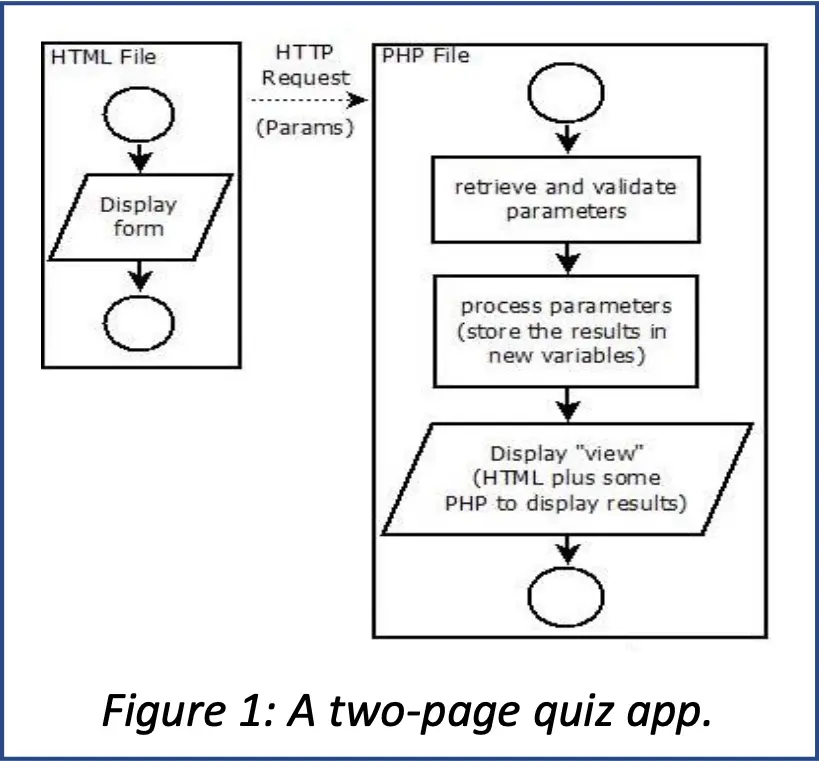
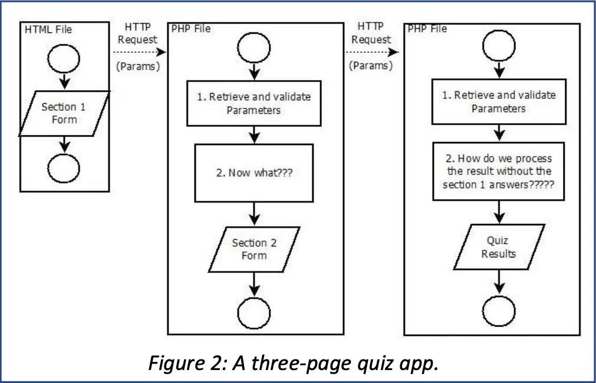
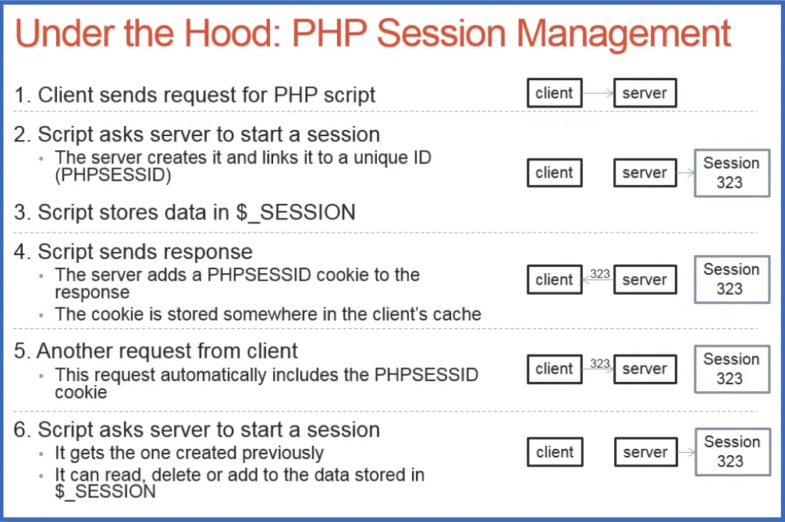
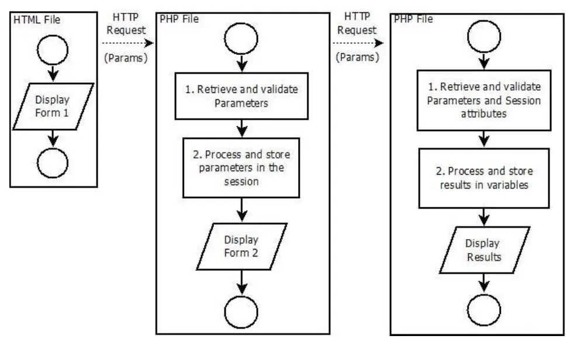

# Session

## Session Management Basics



- Until now you were creating simple, two-page PHP apps as shown in Figure 1
- The first page is HTML with a form that redirects to a second page
- The second page contains PHP code to process the parameters sent from the form
  and display the results
- This setup works well for two-page apps, but not for an app with three or more
  pages
- For example, the first page of your app might contain section 1 of a quiz,
  formatted as a form that the user submits to move on to the second page
- Then the second page contains section 2 of the quiz and the third page
  displays the results
- This situation is shown in Figure 2 below



- The problem here is that the third page must process information from
  parameters sent by both forms, but it only has direct access to the parameters
  from the second page
- The parameters from page 1 were only sent to page 2
- The problem posed by this simple app can be solved using Session Management
  Techniques

## Session Management

- HTTP is a Stateless Protocol
- This means there is no built-in mechanism for linking one HTTP request with
  another
- But most interactions between a user and a web app are conversational – e.g a
  user logs in, searches for products, fills a shopping cart, and goes to the
  checkout
- This conversation is called a session
- But without special session management code, the app cannot know when it
  receives a new HTTP Request what "state" the conversation is in
- Any web app that remembers who the user is or what they were doing from one
  HTTP request to the next is using some form of session management

## Hidden Input Elements

- One way to manage the session for the quiz app discussed above would be to use
  `<input>` elements of type hidden on the second page
- The PHP code on page 2 would pass on all the parameters from the first form
  using these elements
- Similarly, you could encode GET parameters into the links on a page to pass on
  information about the session to the next page
- This can be made to work, but it requires a lot from the programmer
- If the programmer forgets something or makes a mistake, it will disrupt the
  session
- It’s also easily hacked
- PHP provides support for a much better way of managing sessions

## PHP Session Management

- PHP implements session management by sending a cookie (a small piece of named
  data) to the client as part of the HTTP Response
- The cookie is called `PHPSESSID` and it contains a unique id to identify the
  user
- This cookie is stored in the browser, linked to the domain that sent it
- When a user initiates a new HTTP request, the browser sends all cookies linked
  to that domain as part of the request
- When a request arrives with a `PHPSESSID` cookie attached, a PHP script can
  retrieve, modify, and store information in the session using in a special
  associative array called `$_SESSION`
- This process is shown in the figure below



## Viewing and Manipulating Cookies

- To view the cookies sent by a web site, open the Chrome Developer Tools and go
  to the Application tab
- You can also set, delete, and read your own cookies from a PHP program

## The Three-Page Quiz

- Here is the solution to the problem posed by the three-page quiz app
- The first page contains a form that sends parameters to the second page
- The second page is a PHP script that does the following:
  - Starts a session (causing the server to attach `PHPSESSID` to the HTTP
    Response)
  - Retrieves the HTTP Request parameters
  - Stores the them in the session
  - Displays the second form
- Then the third page is a PHP script that does the following:
  - Accesses the existing session1
  - Retrieves the request parameters along with values stored in the session
    object
  - Processes the parameters and session information and stores the results in
    variables d
  - Displays the results



## Session Management Functions and Variables

- The following functions and variables are available to any PHP script
- To see them in action, look at the w3schools examples on Canvas (or play with
  them on w3schools directly).

```php
session_start();
```

- Starts or resumes a session
- Must be called before any output has been written into the HTTP Response (i.e.
  above the `<!DOCTYPE html>` line in a PHP web page)
- If you call this function after writing part of the response, you risk an
  error
- However if any text (even carriage return) appears before the `<!DOCTYPE>` tag
  in an HTML document, browsers will enter their so-called "quirks" modes, with
  unpredictable results For that reason, always make sure there is no output
  whatsoever before the `<!DOCTYPE>` tag:

```php
<?php session_start(); ?><!DOCTYPE html>
```

- No spaces or carriage returns here!

## $_SESSION

- An associative array that stores data for the current session
- You can store values of any type in this array, including objects and arrays
- This variable is called a superglobal because you can access it inside
  functions and methods without having to declare it as a global variable

## isset($_SESSION["key"])

- The isset function can be used to check if a key exists in an associative
  array
- It returns true if “key” has a value and false if it does not
- You can use it to make sure the session is active and contains the correct
  information before attempting to use it
- Otherwise, if the session has expired on the server or if the user has loaded
  this page from a bookmark without coming through the front door, you risk an
  undefined index error.

## session_destroy();

- Terminates the session and removes all data associated with it
- The next call to `session_start` will start a new session with an empty
  $_SESSION array
- Note that you must call `session_start` to resume the session before you can
  destroy it

## Session Management Examples

### The Conversation Example

- This is an example of a multi-step conversation with a user in which data is
  collected from a form at each step
- This is a bit like a multi-stage registration process

1. step1.html

- Uses a form to get the user’s name and sends it as a GET parameter to
  step2.php

2. step2.php

- Calls session_start to create a new session
- Stores the name from step 1 in $_SESSION
- Uses a form to get the user’s age and redirects to step3.php

3. step3.php

- Calls session_start to continue the session
- Stores the age from step 2 in $_SESSION
- Uses a form to get the user’s favorite color and redirects to step4.php

4. step4.php

- Calls session_start to continue the session
- Accesses and reports the user’s favorite color from the GET parameter
- Accesses and reports the user’s name and age from $_SESSION
- Destroys the session

### The Login Example

- This is a simple example of a site that won’t allow access to any pages if you
  are not logged in
- The username and password are hardcoded into the menu.php script
- If `$_SESSION["userid"]` is set, then you are authorized otherwise, access is
  denied

1. index.html

- Uses a form to get the userid and password, sends it to menu.php

2. menu.php

- If it gets POST parameters for userid and password, it checks them
- If they are correct, it creates a `$_SESSION` value for the key `"userid"`
- Then it gives the user a menu or tells them `"access denied"`
- If the `userid` and `password` are no good, it also destroys the session

3. here.php and there.php

- These scripts represent places to go within the web site
- Each one checks $_SESSION["userid"] and bails out if it’s not set

4. logout.php

- Destroys the session and offers a link back to the login screen

## Session Management with Ajax

- When you send an Ajax request to a PHP file, you can call session_start and
  access the $_SESSION object just as you would on a PHP web page
- Don’t forget to specify `{ credentials: include }` in the list of options for
  your fetch request to make sure the cookies are sent
- Otherwise, the server might not receive the `PHPSESSID` cookie and may not be
  able to give you access to the session.
- If being logged in is required to access your app, then you should check to
  make sure a valid session exists by calling isset before you perform any tasks
  in response to an Ajax request
- If there is no valid session, your script can echo an error code instead of
  its usual response

### The Ajax Example

- The index.php script sets a `$_SESSION` key representing how many customers
  are in front of the user in line
- Then the checknum.php script is requested via fetch whenever the button on the
  page is clicked
- This script "advances" the user in line by a random amount, and then returns a
  `JSONEncoded` object to let the app know how many positions the user advanced,
  and what their position is now
- When they get to position 0, checknum.php destroys the session
- If there is no active session, checknum.php returns the error code -1
- The takeanumber.js script sends the Ajax request to checknum.php and
  interprets the result, checking first for error code -1
